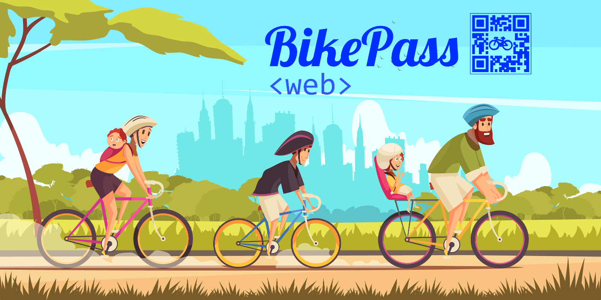

## What is BikePass ?

Bikepass is new way of transport with bike sharing and paying for amount you used ! :open_mouth:  

In web application :computer:	you can see where are the bikes :bike: currently  
Change your information :clipboard:  
Send messages :email:	and receive messages :mailbox: 

[Visit website for more information](http://bikepass.herokuapp.com/)

 # Developers

:pencil: [Mustafa Ünal](https://github.com/berkayataeli)  
:pencil:[Berkay Ataeli](https://github.com/Theieyrre)   

[Our Trello Page](https://trello.com/b/SeSQEz4I/bikepass)  
[BikePass Report](https://docs.google.com/document/d/1_GS6Z9DDU9Q5ximt30LGuUkkoVncaT0maX8dL6as1hI/edit?usp=sharing)  

